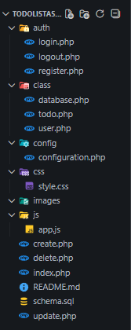

# ✅ To Do List Assistant

> Aplikasi manajemen tugas sederhana berbasis web yang mendukung pengelolaan data secara efisien melalui fitur CRUD.

---

## 📖 Deskripsi Project
**To Do List Assistant** adalah aplikasi berbasis web yang dirancang untuk membantu pengguna dalam mencatat, mengatur, dan memantau tugas harian.  
Aplikasi ini menyediakan fitur utama **Create, Read, Update, dan Delete (CRUD)** yang diimplementasikan menggunakan **PHP Native** dan **MySQL**.

Project ini dikembangkan sebagai bagian dari tugas perkuliahan dengan tujuan melatih pemahaman konsep **pengembangan sistem backend**, integrasi frontend–backend, serta penggunaan **version control (Git & GitHub)** secara kolaboratif.


## 🚀 Fitur Utama
- ➕ Menambahkan tugas baru  
- 📋 Menampilkan daftar tugas  
- ✏️ Mengedit tugas  
- 🗑️ Menghapus tugas  
- 💾 Penyimpanan data menggunakan database MySQL  

---

## 👨‍💻 Anggota Kelompok 
Project ini dikembangkan secara berkelompok oleh:

###  I Md. Andika Maha Gangga Putra 
- Nim : 240030092
- Username github : Marcopolo-Amgp
- Peran : Sebagai ketua kelompok dan mengatur logic dari program to do list asisstant 

### Putu Tesa Wahyuningrat 
- Nim : 240030083 
- Username github : Tesawahyuni
- Peran : Membuat kerangka tampilan CRUD 

### I Gusti Ayu Ratih Lyana Saraswati Rayna 
- Nim : 240030062
- Username github : lyanarayna 
- Peran : Membuat bagian style css dan beberapa kerangka tampilan 
---

## 🛠️ Lingkungan Pengembangan
Aplikasi atau tools yang digunakan dalam pembuatan serta pengembangan aplikasi ini:
- Visual Code Studio
- MySQL Workbech
- XAMPP 

Dengan beberapa bahasa yaitu :
- PHP native 
- HTML
- CSS
- JavaScript
---

## 📌 Hasil Pengembangan
### 🔐 1. Modul Autentikasi (Auth)

Modul autentikasi ditempatkan pada folder `auth/` dan berfungsi untuk mengelola akses pengguna ke sistem.

**Fitur yang diimplementasikan:**
- **Login**
  - Pengguna login menggunakan email dan password
  - Validasi kredensial dengan hashing password
  - Menggunakan session untuk menjaga status login
- **Register**
  - Pembuatan akun baru (username, email, password)
  - Validasi input dan pengecekan email unik
  - Password disimpan menggunakan `password_hash()`
- **Logout**
  - Menghapus seluruh session pengguna
  - Redirect kembali ke halaman login

**📂 File terkait:** `auth/login.php`, `auth/register.php`, `auth/logout.php`, `class/User.php`

---

### 📝 2. Todo List (CRUD)
**Fitur yang diimplementasikan:**
- **Create Todo**
  - Menambahkan todo baru (judul & deskripsi)
  - Todo otomatis terhubung dengan user yang sedang login
- **Read Todo**
  - Menampilkan daftar todo berdasarkan user login
- **Update Todo**
  - Mengubah judul, deskripsi, dan status todo
  - Status todo: `pending` atau `completed`
- **Delete Todo**
  - Menghapus todo
  - Dilengkapi konfirmasi penghapusan menggunakan JavaScript

**📂 File terkait:** `index.php`, `create.php`, `update.php`, `delete.php`, `class/Todo.php`

---

### 👤 3. Manajemen User

**Fitur yang diimplementasikan:**
- Penyimpanan data user ke database
- Relasi one-to-many antara user dan ToDo
- Session management untuk menyimpan status login

**📂 File terkait:** `class/user.php`

---

### 🗄️ 4. Database & Konfigurasi

**Fitur yang diimplementasikan:**

- Koneksi database menggunakan PDO
- Konfigurasi database terpusat
- Struktur database relasional (users & todo)

**📂 File terkait:** `config/configuration.php`, `class/database.php`

---

### 🎨 5. Antarmuka Pengguna (UI)

**Fitur yang diimplementasikan:**

- Halaman login & register dengan tampilan khusus
- Halaman utama ToDo berbasis tabel
- Form create & update dengan layout card
- Halaman konfirmasi delete
- Desain responsif dasar

**📂 File terkait:** `css/style.css`

---

### ⚙️ 6. JavaScript (Client-side Enhancement)

**Fitur yang diimplementasikan:**

- Auto-hide alert / notifikasi
- Validasi UX (disable submit button saat proses)
- Konfirmasi penghapusan ToDo
- Pencegahan double submit form

**📂 File terkait:** `js/app.js`

---

### 🔄 7. Integrasi Git & Kolaborasi

- **Struktur branch:**
    - `main` → branch utama (stable)
    - `logic-project` → pengembangan backend & logic
    - `tesa-ui` → pengembangan UI oleh Tesa
    - `lyana-ui` → pengembangan UI oleh Lyana
- **Workflow:**
    - Setiap fitur dikembangkan di branch masing-masing
    - Pull Request digunakan untuk merge ke `main`
    - Sinkronisasi dilakukan menggunakan `git pull origin main`


## 📁 Struktur Folder
Berikut adalah struktur folder pada project **`Todo List Assistant`** beserta penjelasannya:



*Gambar 1. Struktur File Project*

```todolistassistant/
├── auth/
│ ├── login.php
│ ├── logout.php
│ └── register.php
│
├── class/
│ ├── database.php
│ ├── todo.php
│ └── user.php
│
├── config/
│ └── configuration.php
│
├── css/
│ └── style.css
│ 
├── image/
│ └── struktur-file.png
│ 
├── js/
│ └── app.js
│
├── create.php
├── update.php
├── delete.php
├── index.php
├── schema.sql
└── README.md
```


### 📂 Penjelasan Struktur

#### 🔐 `auth/`
Folder yang menangani **autentikasi pengguna**:
- `login.php` → Halaman dan proses login user
- `logout.php` → Proses logout dan penghancuran session
- `register.php` → Halaman pendaftaran akun baru

#### 🧠 `class/`
Berisi **class PHP berbasis OOP** sebagai logic backend:
- `database.php` → Class koneksi database (PDO)
- `user.php` → Logic user (login, register, logout)
- `todo.php` → Logic CRUD Todo List

#### ⚙️ `config/`
- `configuration.php` → Konfigurasi utama aplikasi (session, koneksi database, dll)

#### 🎨 `css/`
- `style.css` → Styling global untuk seluruh halaman aplikasi

#### 📷 `image/`
- `struktur-file.png` → Gambar / Screenshot struktur project backend

#### ⚡ `js/`
- `app.js` → JavaScript untuk interaksi UI (alert auto close, confirm delete, validasi UX, dll)

#### 📄 File Utama Aplikasi
- `index.php` → Halaman utama (list todo berdasarkan user)
- `create.php` → Halaman tambah todo
- `update.php` → Halaman edit todo
- `delete.php` → Proses & konfirmasi hapus todo

#### 🗄️ Database
- `schema.sql` → Struktur database (tabel users & todo)

#### 📘 Dokumentasi
- `README.md` → Dokumentasi project


## 🚀 Cara Instalasi dan Menjalankan Aplikasi
Panduan berikut menjelaskan langkah-langkah untuk menjalankan aplikasi **`Todo List Assistant`** di lingkungan lokal.

---

### 📌 1. Prasyarat (Requirements)
Pastikan perangkat kamu sudah terpasang:

- PHP ≥ 8.0
- MySQL Workbench / MariaDB 
- Web Server (disarankan menggunakan XAMPP / Laragon)
- Git
- Browser (Chrome, Firefox, dll)

> ⚠️ Aplikasi dijalankan menggunakan **`PHP Built-in Web Server`**
---

### 📥 Clone Repository

Jika project diambil dari GitHub:

```
git clone https://github.com/Marcopolo-Amgp/ToDoListAssistant.git

cd ToDoListAssistant
```
> Atau bisa juga langsung **donwload ZIP** nya dari github lalu https://github.com/Marcopolo-Amgp/ToDoListAssistant.git lalu extract file.

---
### 🗄️ Setup Database
1. Buka MySQL Workbench
2. Jalankan MySQL Server
3. Buat database dan tabel dengan menjalankan file berikut: `schema.sql`, atau copy-paste isi dari `schema.sql` ke MySQL Workbech lalu **Execute**

> **❗Pastikan database berhasil dibuat**
---

### ⚙️ Konfigurasi Database
Buka file:
```
config/configuration.php
```
Sesuaikan konfigurasi koneksi database:
```
define('DB_HOST', 'localhost');
define('DB_USER', 'root');
define('DB_PASS', '');
define('DB_NAME', 'todo_list');
```
Sesuaikan `DB_USER` dan `DB_PASS` dengan konfigurasi MySQL kamu.

---

### ▶️ Menjalankan Aplikasi (PHP Built-in Server)
Masuk ke folder root project, lalu jalankan perintah:
```
php -S localhost:8000
```
Jika berhasil, akan muncul output seperti:
```
PHP 8.x Development Server started at http://localhost:8000
```
---

### 🌐 Akses Aplikasi
Buka browser dan akses:
``` 
http://localhost:8000 
```
Secara default:
- User akan diarahkan ke halaman Login
- Jika belum punya akun, klik Register
---
# ✅ Aplikasi Siap Digunakan